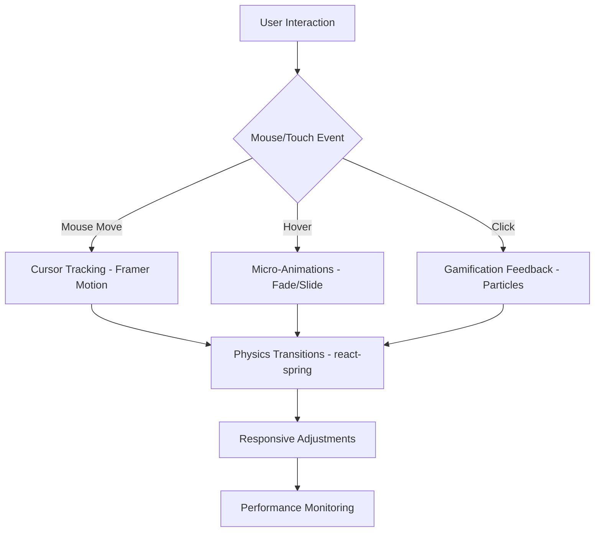

# EduScrapeApp Animation and Interactive Effects Plan

## Overview
This plan outlines detailed animations and interactive effects for the website overhaul, inspired by Antigravity IDE (mouse follow animations: cursor-tracking elements, trailing particles, physics-based transitions) and AgriHorizons (micro-animations: fade, slide, float). It includes gamification feedback and integrates with the solid-color theme and responsive design as per the UI overhaul design specification.

## Animation Libraries
- **Primary Library**: Framer Motion - Chosen for its declarative API, performance optimizations, and support for complex animations like physics-based transitions and mouse tracking. It's React-native and integrates well with Tailwind CSS.
- **Alternative/Complementary**: react-spring - For physics-based animations and smooth transitions, especially for trailing particles and cursor-follow effects.
- **Why these?**: Both provide GPU-accelerated animations, reducing layout thrashing. Framer Motion for component-level animations, react-spring for more granular physics simulations.

## Component-Specific Animation Strategies

### Header
- **Mouse Follow**: Cursor-tracking navigation items that subtly shift position based on mouse proximity, using Framer Motion's `useMotionValue` and `useTransform`.
- **Micro-Animations**: Hover effects with color shift and subtle lift (translateY: -2px). Menu toggle with slide-in animation.
- **Gamification**: If user has achievements, display badge icons with scale-in animation on hover.
- **Responsive**: On mobile, reduce mouse follow to touch-based hover equivalents.

### Hero Section
- **Mouse Follow**: Central logo/title with trailing particles that follow the cursor, using react-spring for particle physics (spring-based movement).
- **Micro-Animations**: Buttons with scale-down on press, float animation for call-to-action elements.
- **Transitions**: Page load with staggered fade-in of elements.
- **Gamification**: Progress indicators or level badges with animated counters.

### About Section (Stats/Cards)
- **Micro-Animations**: Staggered fade-in on scroll reveal using Framer Motion's `whileInView`. Animated counters for stats (e.g., number increment with easing).
- **Hover Effects**: Cards lift slightly on hover, with slide-in sub-elements.
- **Mouse Follow**: Optional cursor-tracking highlights on cards.

### Features/Projects Section
- **Interactive Cards**: Hover with physics-based tilt (using Framer Motion's `useMotionValue`), slide animations for content reveal.
- **Mouse Follow**: Trailing elements on card hover, like floating icons.
- **Gamification**: Completion animations for project milestones, with confetti-like particles.

### Team Section
- **Elevated Profiles**: Hover animations with scale and shadow increase. Float animations for profile images.
- **Mouse Follow**: Cursor-tracking tooltips or additional info panels.

### Updates Section (Timeline)
- **Animated Progress**: Timeline bubbles with physics-based expansion on scroll. Progress bars with smooth fill animations.
- **Micro-Animations**: Staggered reveals for timeline items.

### Dashboard
- **Role-Based Views**: Transitions between tabs with blur effects and slide animations.
- **Cards**: Hover lifts, with mouse follow for interactive elements like charts.
- **Gamification**: Animated progress bars, badge unlocks with scale and particle effects, leaderboard animations (ranking changes with smooth transitions).
- **AI Assistant**: Cursor-tracking chat bubble, typing animations with dots.

### Footer
- **Social Icons**: Hover with scale and color shift. Mouse follow for icon trails.

### General UX Enhancements
- **Gamification Feedback**: Toast notifications with slide-in from top/right, using Framer Motion. Achievement modals with scale-in and particle bursts.
- **Loading States**: Spinners with physics-based rotation, progress bars.
- **Transitions**: Page-to-page with blur and fade, maintaining solid-color theme.

## Performance Considerations
- **GPU Acceleration**: Use `transform` and `opacity` for animations to leverage hardware acceleration.
- **Frame Rate**: Target 60fps; use `will-change` CSS property sparingly.
- **Bundle Size**: Lazy-load animation libraries if not used on all pages.
- **Reduced Motion**: Respect `prefers-reduced-motion` by disabling complex animations.
- **Mobile Optimization**: Simplify mouse follow on touch devices; use `pointer-events` to avoid unnecessary computations.
- **Debouncing**: For mouse move events, debounce to prevent excessive re-renders.

## Integration with Solid-Color Theme and Responsive Design
- **Theme Integration**: Animations enhance solid colors without introducing glass effects. Use theme variables for animation colors (e.g., hover states tied to primary color).
- **Responsive**: Scale animations down on smaller screens (e.g., reduce particle count). Use Tailwind's responsive utilities for breakpoint-specific animations.
- **Accessibility**: Ensure all animations are optional and don't interfere with screen readers. Provide static alternatives.

## Implementation Phases
1. **Setup Libraries**: Install and configure Framer Motion and react-spring.
2. **Core Animations**: Implement micro-animations for basic components.
3. **Mouse Follow**: Add cursor-tracking for Header and Hero.
4. **Gamification**: Integrate feedback animations.
5. **Polish**: Optimize performance and responsive behavior.

## Mermaid Diagram: Animation Flow

This plan provides a detailed guide for implementing engaging, performant animations that enhance the user experience while aligning with the design specification.