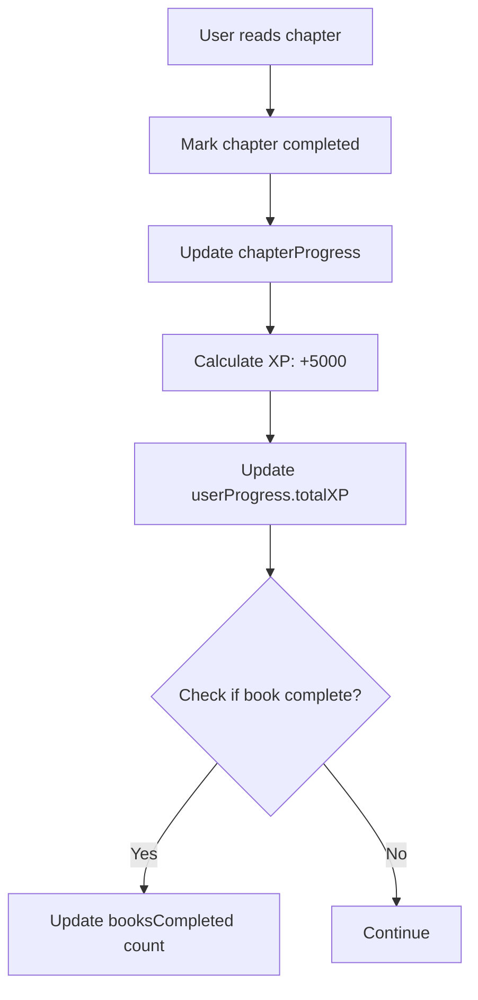
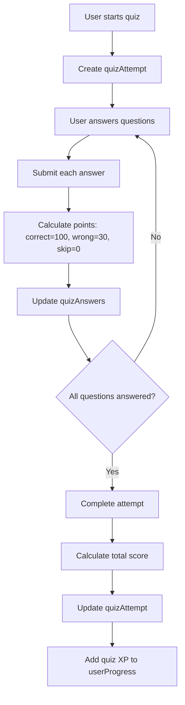
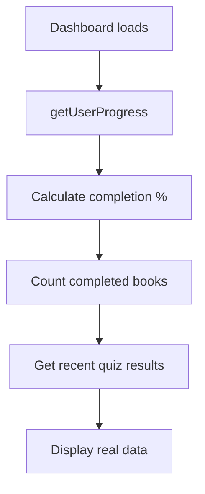
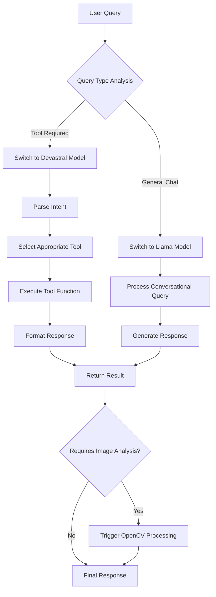

# User Progress Tracking Database Schema Design

## Overview
This design implements comprehensive progress tracking for the educational platform, including XP points, completion percentages, books read, quiz results, and chapter completions.

## Data Model

### Core Entities

#### Books
```typescript
books: defineTable({
  path: v.string(), // ZIP file path (e.g., "Class10/Maths/Maths.zip")
  grade: v.string(), // Class1-Class12
  subject: v.string(), // Maths, Science, English, etc.
  title: v.string(), // Derived from filename (e.g., "Maths")
  totalChapters: v.number(), // Populated after scanning ZIP
  estimatedReadTime: v.optional(v.number()), // minutes
  url: v.string(), // Full Firebase URL
})
.index("by_grade", ["grade"])
.index("by_path", ["path"])
.index("by_grade_subject", ["grade", "subject"])
```

#### Chapters
```typescript
chapters: defineTable({
  bookPath: v.string(), // Reference to books.path
  pdfPath: v.string(), // Path within ZIP (e.g., "Chapter1.pdf")
  identifiedTitle: v.optional(v.string()), // AI-identified chapter title
  isSupplementary: v.boolean(), // AI-determined: exclude index/PS files
  grade: v.string(), // Inherited from book
})
.index("by_book", ["bookPath"])
.index("by_grade", ["grade"])
```

#### User Progress (Overall Stats)
```typescript
userProgress: defineTable({
  userId: v.id("users"),
  totalXP: v.number(),
  booksCompleted: v.number(),
  chaptersCompleted: v.number(),
  quizzesPassed: v.number(),
  currentStreak: v.number(),
  longestStreak: v.number(),
  lastActivity: v.number(), // timestamp
})
.index("by_user", ["userId"])
```

#### Chapter Progress
```typescript
chapterProgress: defineTable({
  userId: v.id("users"),
  chapterId: v.id("chapters"),
  completed: v.boolean(),
  completedAt: v.optional(v.number()),
  timeSpent: v.number(), // seconds
  pagesRead: v.number(),
  totalPages: v.number(),
})
.index("by_user", ["userId"])
.index("by_chapter", ["chapterId"])
.index("by_user_chapter", ["userId", "chapterId"])
```

#### Quizzes
```typescript
quizzes: defineTable({
  chapterId: v.id("chapters"),
  title: v.string(),
  description: v.optional(v.string()),
  passingScore: v.number(), // percentage 0-100
  timeLimit: v.optional(v.number()), // minutes
  maxAttempts: v.optional(v.number()),
})
.index("by_chapter", ["chapterId"])
```

#### Quiz Questions
```typescript
quizQuestions: defineTable({
  quizId: v.id("quizzes"),
  question: v.string(),
  type: v.union(v.literal("multiple_choice"), v.literal("true_false"), v.literal("short_answer")),
  options: v.optional(v.array(v.string())), // for multiple choice
  correctAnswer: v.string(),
  explanation: v.optional(v.string()),
  points: v.number(),
})
.index("by_quiz", ["quizId"])
```

#### Quiz Attempts
```typescript
quizAttempts: defineTable({
  userId: v.id("users"),
  quizId: v.id("quizzes"),
  attemptNumber: v.number(),
  startedAt: v.number(),
  completedAt: v.optional(v.number()),
  score: v.optional(v.number()), // percentage
  totalPoints: v.optional(v.number()),
  earnedPoints: v.optional(v.number()),
  passed: v.optional(v.boolean()),
  timeSpent: v.optional(v.number()), // seconds
})
.index("by_user", ["userId"])
.index("by_quiz", ["quizId"])
.index("by_user_quiz", ["userId", "quizId"])
```

#### Quiz Answers
```typescript
quizAnswers: defineTable({
  attemptId: v.id("quizAttempts"),
  questionId: v.id("quizQuestions"),
  userAnswer: v.string(),
  isCorrect: v.boolean(),
  pointsEarned: v.number(),
  timeSpent: v.optional(v.number()), // seconds on this question
})
.index("by_attempt", ["attemptId"])
```

## Data Calculations

### XP System
- **Chapter Completion**: 5000 XP per chapter
- **Book Completion**: Sum of all chapter XP (chapters × 5000)
- **Quiz Performance**:
  - Correct answer: 100 XP
  - Wrong answer: 30 XP
  - Skipped question: 0 XP

### Completion Percentage
- **Chapter Level**: (pagesRead / totalPages) × 100
- **Book Level**: (chaptersCompleted / totalChapters) × 100
- **Overall Progress**: (chaptersCompleted / totalChaptersAcrossAllBooks) × 100

### Books Read Count
- Books where all non-supplementary chapters are completed

### Quiz Results
- Score = (earnedPoints / totalPoints) × 100
- Pass = score >= passingScore
- Latest attempt determines current status

## Convex Functions

### Progress Tracking
```typescript
// Mark chapter as completed
markChapterCompleted: mutation({
  args: {
    chapterId: v.id("chapters"),
    timeSpent: v.number(), // seconds spent reading
    pagesRead: v.number(),
    totalPages: v.number()
  },
  returns: v.object({
    success: v.boolean(),
    xpEarned: v.number(),
    bookCompleted: v.optional(v.boolean())
  }),
  handler: async (ctx, args) => {
    // Validates user authentication
    // Checks if chapter exists and is not supplementary
    // Updates or creates chapterProgress record
    // Calculates and awards XP (5000 per chapter)
    // Updates userProgress totals
    // Checks if book is now complete
    // Throws errors for: invalid chapter, already completed, authentication failed
  }
})

// Get user progress summary
getUserProgress: query({
  args: {},
  returns: v.object({
    totalXP: v.number(),
    booksCompleted: v.number(),
    chaptersCompleted: v.number(),
    quizzesPassed: v.number(),
    currentStreak: v.number(),
    longestStreak: v.number(),
    lastActivity: v.number(),
    completionPercentage: v.number()
  }),
  handler: async (ctx) => {
    // Requires authentication
    // Aggregates data from userProgress table
    // Calculates completion percentage across all books
    // Returns null if user not authenticated
  }
})

// Get book progress for a user
getBookProgress: query({
  args: { bookPath: v.string() },
  returns: v.object({
    bookPath: v.string(),
    chaptersCompleted: v.number(),
    totalChapters: v.number(),
    completionPercentage: v.number(),
    chapters: v.array(v.object({
      chapterPath: v.string(),
      completed: v.boolean(),
      completedAt: v.optional(v.number()),
      timeSpent: v.number()
    }))
  }),
  handler: async (ctx, args) => {
    // Validates book exists
    // Gets all chapters for the book
    // Gets user's progress for each chapter
    // Throws error if book not found
  }
})

// Get chapter progress
getChapterProgress: query({
  args: { chapterId: v.id("chapters") },
  returns: v.object({
    completed: v.boolean(),
    completedAt: v.optional(v.number()),
    timeSpent: v.number(),
    pagesRead: v.number(),
    totalPages: v.number(),
    completionPercentage: v.number()
  }),
  handler: async (ctx, args) => {
    // Returns user's progress for specific chapter
    // Returns default values if no progress recorded
  }
})
```

### Quiz Management
```typescript
// Start quiz attempt
startQuizAttempt: mutation({
  args: { quizId: v.id("quizzes") },
  returns: v.object({
    attemptId: v.id("quizAttempts"),
    attemptNumber: v.number(),
    questions: v.array(v.object({
      questionId: v.id("quizQuestions"),
      question: v.string(),
      type: v.string(),
      options: v.optional(v.array(v.string()))
    }))
  }),
  handler: async (ctx, args) => {
    // Validates quiz exists and user has access
    // Checks attempt limits
    // Creates new quizAttempts record
    // Returns question data for the quiz
    // Throws errors for: quiz not found, max attempts reached, authentication failed
  }
})

// Submit quiz answer
submitQuizAnswer: mutation({
  args: {
    attemptId: v.id("quizAttempts"),
    questionId: v.id("quizQuestions"),
    answer: v.string(),
    timeSpent: v.optional(v.number())
  },
  returns: v.object({
    correct: v.boolean(),
    pointsEarned: v.number(),
    explanation: v.optional(v.string())
  }),
  handler: async (ctx, args) => {
    // Validates attempt belongs to user and is active
    // Checks if question belongs to quiz
    // Records answer in quizAnswers
    // Calculates points (100 correct, 30 wrong, 0 skip)
    // Returns feedback
    // Throws errors for: invalid attempt, question not in quiz, attempt completed
  }
})

// Complete quiz attempt
completeQuizAttempt: mutation({
  args: { attemptId: v.id("quizAttempts") },
  returns: v.object({
    score: v.number(), // percentage
    passed: v.boolean(),
    xpEarned: v.number(),
    totalPoints: v.number(),
    earnedPoints: v.number()
  }),
  handler: async (ctx, args) => {
    // Validates attempt ownership and completion status
    // Calculates final score from all answers
    // Updates quizAttempts record
    // Awards XP based on performance
    // Updates user quiz statistics
    // Throws errors for: attempt not found, already completed, missing answers
  }
})

// Get quiz results
getQuizResults: query({
  args: { quizId: v.id("quizzes") },
  returns: v.object({
    bestScore: v.number(),
    attempts: v.array(v.object({
      attemptNumber: v.number(),
      score: v.number(),
      passed: v.boolean(),
      completedAt: v.number(),
      timeSpent: v.number()
    }))
  }),
  handler: async (ctx, args) => {
    // Returns user's quiz history for specific quiz
    // Includes all attempts with scores
  }
})
```

### Data Retrieval
```typescript
// Dashboard data
getDashboardStats: query({
  args: {},
  returns: v.object({
    userProgress: v.object({
      totalXP: v.number(),
      booksCompleted: v.number(),
      chaptersCompleted: v.number(),
      quizzesPassed: v.number(),
      completionPercentage: v.number()
    }),
    recentActivity: v.array(v.object({
      type: v.union(v.literal("chapter_completed"), v.literal("quiz_passed"), v.literal("book_completed")),
      title: v.string(),
      timestamp: v.number(),
      xpEarned: v.optional(v.number())
    })),
    currentGoals: v.object({
      weeklyXP: v.number(),
      targetXP: v.number(),
      booksThisMonth: v.number(),
      targetBooks: v.number()
    })
  }),
  handler: async (ctx) => {
    // Aggregates data for dashboard display
    // Requires authentication
  }
})

// Recent activity
getRecentActivity: query({
  args: { limit: v.optional(v.number()) },
  returns: v.array(v.object({
    id: v.string(),
    type: v.string(),
    title: v.string(),
    description: v.string(),
    timestamp: v.number(),
    xpEarned: v.optional(v.number())
  })),
  handler: async (ctx, args) => {
    // Returns chronological list of recent user activities
    // Defaults to limit of 10
  }
})

// Leaderboard
getLeaderboard: query({
  args: {
    type: v.union(v.literal("xp"), v.literal("books"), v.literal("quizzes")),
    limit: v.optional(v.number())
  },
  returns: v.array(v.object({
    userId: v.id("users"),
    name: v.string(),
    grade: v.string(),
    value: v.number(), // XP, books completed, or quizzes passed
    rank: v.number()
  })),
  handler: async (ctx, args) => {
    // Returns ranked list based on specified metric
    // Defaults to XP leaderboard with limit of 50
  }
})
```

### Book/Chapter Management
```typescript
// Sync books from Firebase data
syncBooksFromFirebase: mutation({
  args: {},
  returns: v.object({
    booksAdded: v.number(),
    booksUpdated: v.number()
  }),
  handler: async (ctx) => {
    // Fetches structure.json and zips.json from Firebase
    // Creates/updates books records
    // Requires admin privileges
  }
})

// Identify chapters in a book (AI-powered)
identifyChaptersInBook: mutation({
  args: { bookPath: v.string() },
  returns: v.array(v.object({
    pdfPath: v.string(),
    identifiedTitle: v.string(),
    isSupplementary: v.boolean()
  })),
  handler: async (ctx, args) => {
    // Downloads and analyzes ZIP file
    // Uses OpenCV/image-to-text to identify chapters
    // Creates chapter records
    // Returns identified chapters
    // Throws errors for: book not found, ZIP download failed, AI processing failed
  }
})
```

## Data Flow Diagrams

### Chapter Completion Flow


### Quiz Attempt Flow


### Dashboard Data Flow


## Implementation Notes

1. **Book/Chapter Discovery**: Books and chapters will be populated by admin functions that scan the ZIP structure
2. **Progress Persistence**: All progress is stored permanently, allowing users to resume where they left off
3. **XP Validation**: XP calculations happen server-side to prevent cheating
4. **Quiz Integrity**: Quiz attempts are time-stamped and validated
5. **Performance**: Use appropriate indexes for common queries
6. **Migration**: Existing mock data in dashboard will be replaced with real queries

## AI Agent Architecture

### Overview
The AI agent system provides intelligent assistance for educational content, combining quiz generation, book recommendations, progress analysis, and doubt clearance. The agent uses OpenRouter API with specialized models for different tasks.

### Model Configuration
- **Tool Calling**: Devastral model via OpenRouter for structured operations (quizzes, progress tracking, book analysis)
- **General Chat**: Llama model via OpenRouter for conversational doubt clearance and explanations
- **Image Analysis**: OpenCV integration for PDF content recognition and chapter identification

### Tool Functions

#### Quiz Management Tools
```typescript
// Generate quiz for a chapter
generateChapterQuiz: tool({
  name: "generate_chapter_quiz",
  description: "Creates a quiz for a specific chapter with multiple choice and true/false questions",
  parameters: {
    chapterId: { type: "string", description: "ID of the chapter" },
    difficulty: { type: "string", enum: ["easy", "medium", "hard"] },
    questionCount: { type: "number", minimum: 5, maximum: 20 }
  },
  handler: async (args) => {
    // Analyzes chapter content
    // Generates relevant questions
    // Stores quiz in database
    // Returns quiz ID and questions
  }
})

// Grade quiz attempt
gradeQuizAttempt: tool({
  name: "grade_quiz_attempt",
  description: "Evaluates user answers and provides detailed feedback",
  parameters: {
    attemptId: { type: "string", description: "Quiz attempt ID" }
  },
  handler: async (args) => {
    // Retrieves attempt and answers
    // Calculates scores
    // Provides explanations
    // Updates progress
  }
})
```

#### Book and Content Tools
```typescript
// Analyze book content
analyzeBookContent: tool({
  name: "analyze_book_content",
  description: "Uses AI to identify chapters and content structure in PDF books",
  parameters: {
    bookPath: { type: "string", description: "Path to the book ZIP file" }
  },
  handler: async (args) => {
    // Downloads ZIP file
    // Extracts PDFs
    // Uses OpenCV for OCR
    // Identifies chapters and supplementary content
    // Updates database
  }
})

// Recommend books
recommendBooks: tool({
  name: "recommend_books",
  description: "Suggests appropriate books based on user grade and progress",
  parameters: {
    userId: { type: "string", description: "User ID" },
    subject: { type: "string", optional: true },
    count: { type: "number", default: 5 }
  },
  handler: async (args) => {
    // Analyzes user progress
    // Considers grade and completed subjects
    // Returns personalized recommendations
  }
})
```

#### Progress Analysis Tools
```typescript
// Analyze learning patterns
analyzeLearningPatterns: tool({
  name: "analyze_learning_patterns",
  description: "Provides insights into user learning habits and recommendations",
  parameters: {
    userId: { type: "string", description: "User ID" },
    timeframe: { type: "string", enum: ["week", "month", "all"] }
  },
  handler: async (args) => {
    // Analyzes progress data
    // Identifies strengths/weaknesses
    // Suggests improvement strategies
  }
})

// Generate progress report
generateProgressReport: tool({
  name: "generate_progress_report",
  description: "Creates detailed progress reports for students and teachers",
  parameters: {
    userId: { type: "string", description: "User ID" },
    reportType: { type: "string", enum: ["summary", "detailed", "trends"] }
  },
  handler: async (args) => {
    // Aggregates progress data
    // Generates formatted reports
    // Includes charts and recommendations
  }
})
```

### Agent Flow Architecture



### Integration Points

1. **Chat Interface**: Seamlessly switches between tool-calling and conversational modes
2. **Library Component**: AI assistance for book selection and chapter identification
3. **Quiz Interface**: Dynamic quiz generation and intelligent feedback
4. **Dashboard**: Progress insights and personalized recommendations
5. **Profile System**: Learning pattern analysis and goal setting

### Error Handling
- **Tool Failures**: Fallback to general chat mode with error explanation
- **API Limits**: Graceful degradation and user notification
- **Content Analysis**: Retry mechanisms for OCR failures
- **Authentication**: Strict user context validation for all operations

## Next Steps
1. Implement schema in `convex/schema.ts`
2. Create Convex functions in `convex/progress.ts` and `convex/quizzes.ts`
3. Implement AI agent with OpenRouter integration
4. Add OpenCV integration for PDF analysis
5. Update Dashboard component to use real data
6. Add progress tracking UI to Library component
7. Implement quiz interface components
8. Integrate AI agent with chat system