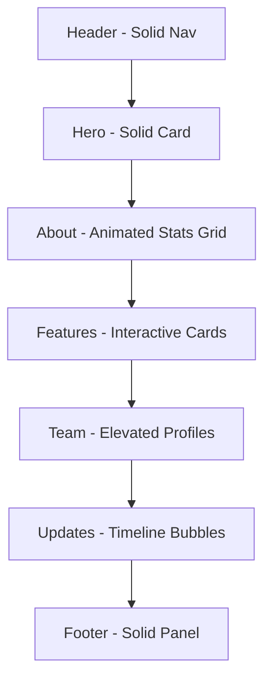
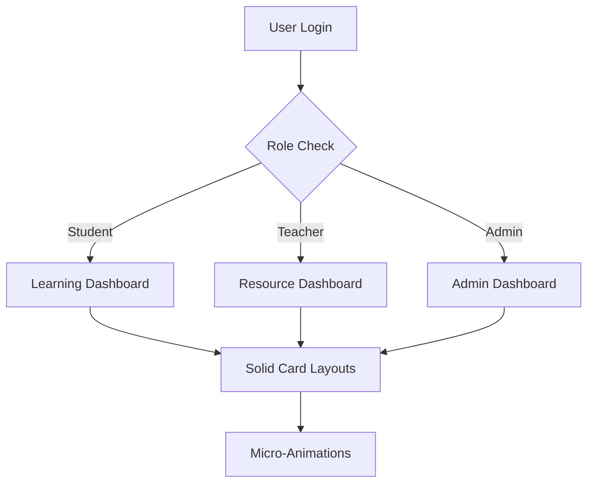

# EduScrapeApp UI Overhaul Design Specification

## Overview
This document outlines a comprehensive redesign of the EduScrapeApp website's UI, drawing inspiration from AgriHorizons (role-based dashboards, glass effects, micro-animations, toast notifications, visual hierarchy). The overhaul enhances UX with improved navigation, interactive feedback, gamification for learning, and responsive design.

## Current Structure Analysis
- **Home View**: Header, Hero (logo/title/buttons), About (stats/cards), Projects (features), Team, Updates, Footer.
- **Dashboard**: Tabbed interface (Overview, Library, Profile) with card-based layouts, AI assistant.
- **Styling**: CSS variables for themes, light/dark mode, basic animations (scale-in, slide-up), hover effects.

## Design Inspirations

### AgriHorizons
- Role-based dashboards with tailored views for different user types.
- Card-based layouts with solid colors and strong visual hierarchy.
- Micro-animations for subtle interactions.
- Toast notifications for user feedback.
- Strong visual hierarchy through typography, spacing, and color contrast.
## New Layout Proposals

### Home Page Layout
- **Header**: Solid navigation bar, animated menu items on hover (color shift, subtle lift).
- **Hero Section**: Central solid card containing logo and title. Buttons with hover effects.
- **About Section**: Grid of solid cards with animated stats counters. Micro-animations on scroll reveal (staggered fade-in).
- **Features/Projects Section**: Interactive cards with hover effects.
- **Team Section**: Elevated profile cards with hover animations.
- **Updates Section**: Timeline with solid bubbles, animated progress indicators.
- **Footer**: Solid panel with animated social icons.

### Dashboard Layouts
- **Role-Based Views**:
  - **Student Dashboard**: Focus on learning progress, gamified elements, library access.
  - **Teacher Dashboard**: Resource management, class insights, collaboration tools.
  - **Admin Dashboard**: System overview, user management, analytics.
- **Card Layouts**: Solid cards with hover lift effects.
- **Navigation**: Tab bar with animations.

## Animation Strategies
- **Micro-Animations**: Button presses (scale down/up), hover lifts (translateY), loading spinners, staggered reveals.
- **Transitions**: Smooth morphing between states, page transitions with blur effects.

## Gamification Elements
- **Progress Bars**: Animated level progress.
- **Badges**: Achievement icons with unlock animations (scale).
- **Points System**: Point counters on actions, leaderboard with animated rankings.
- **Interactive Feedback**: Toast notifications with slide in animations.
- **Learning Paths**: Visual flowcharts with animated nodes, completion celebrations.

## Responsive Design Plan
- **Mobile-First Approach**: Optimize glass effects (reduce blur on low-power devices), stack floating modules vertically.
- **Breakpoints**: sm (640px), md (768px), lg (1024px), xl (1280px).
- **Touch Interactions**: Swipe gestures for navigation, tap animations with haptic feedback simulation.
- **Adaptive Layouts**: Grid systems that collapse gracefully, floating elements that dock on small screens.

## Component Updates
- **Header**: Solid navigation bar.
- **Hero**: Solid card container.
- **About**: Animated stat cards with counters.
- **Dashboard Tabs**: With animations.
- **Cards**: Solid backgrounds with hover animations.
- **Buttons**: Hover effects.
- **Notifications**: Toast system with animations.

## Integration Plans
- **Theme System**: Extend CSS variables for solid colors.
- **Animation Library**: Integrate Framer Motion for micro-animations.
- **Responsive Framework**: Enhance Tailwind with custom utilities for solid colors.
- **Accessibility**: Ensure animations respect prefers-reduced-motion.

## Implementation Phases
1. **Phase 1**: Update theme system and basic glass effects.
2. **Phase 2**: Implement micro-animations and home page redesign.
3. **Phase 3**: Add role-based dashboard layouts with glass cards.
4. **Phase 4**: Integrate gamification elements.
5. **Phase 5**: Polish responsive design and accessibility.

## Mermaid Diagrams

### Home Page Layout Flow

### Dashboard Role-Based Flow

This specification provides a blueprint for transforming EduScrapeApp into a modern, engaging platform inspired by cutting-edge design paradigms.